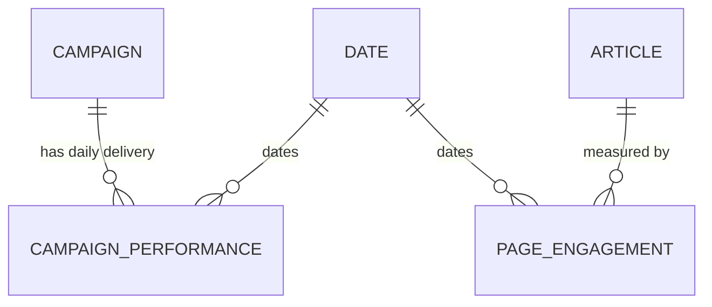

# Conceptual Entity Model: Campaign Performance and Audience Engagement Dashboards (Phase 1)

**Client**: Claybrook Media Group
**Project ID**: 01-campaign-dashboards
**Generated**: 2026-10-05
**Version**: 1.0
**Status**: Draft — awaiting business stakeholder review

## Scope note

This model covers the five entities named in the Statement of Work target
warehouse scope: campaign, campaign performance (daily delivery), article
(content), page engagement, and date. It serves two subject areas for the
advertising sales team: campaign delivery performance and audience engagement.

Phase 1 uses static seed data. Live Google Ad Manager and Google Analytics 4
sources are Phase 2 and out of scope here (requirements FR-11, "seed data
render"). No source schema examples were found in `artifacts/`. Entities were
derived from the approved requirements, the SOW, and recorded rulings. Adding
source schema examples before review may reveal additional attributes.

Business rules are `not_applicable` for this release (ruling R-3), so the usual
advisory dependency on a business rules artifact is waived. This is noted here
rather than treated as a blocker.

## 1. Entity Inventory

### Campaign
**Description**: An advertising campaign sold to an advertiser and run across the publisher's inventory over a booking period.
**Key attributes**: campaign name, advertiser name, agency name, booking start and end dates, booked impression goal, rate card CPM
**Approximate volume**: Seed row count not yet set; deferred to mockup review (ruling R-7). A realistic seed holds tens of campaigns.
**Notes**: Advertiser name and agency name are attributes of the campaign in Phase 1, not separate dimensions. All advertiser, agency, campaign, and publication names in sample data are made up (ruling R-1). This entity backs the warehouse model `campaign_dim` (FR-8).

### CampaignPerformance
**Description**: The daily delivery record for a campaign: how many impressions were served, how many were eligible, and the revenue earned.
**Grain**: One row per campaign per day.
**Key attributes**: campaign reference, delivery date, impressions delivered, eligible impressions, revenue
**Approximate volume**: Campaigns multiplied by active days; seed volume deferred to mockup review (ruling R-7).
**Notes**: The dashboard measures derive from this entity: delivery is impressions delivered; fill rate (`fill_rate_pct`) is delivered over eligible impressions; CPM (`cpm_gbp`) is revenue per thousand impressions (FR-2 "campaign performance dashboard"; FR-9 "LookML semantic layer"). Backs the warehouse model `campaign_performance_fct` (FR-8).

### Article
**Description**: A published article or content item on one of the publisher's publications.
**Key attributes**: article title, publication name, section or category, author, publish date
**Approximate volume**: Seed row count not yet set; deferred to mockup review (ruling R-7).
**Notes**: Publication and article names in sample data are made up (ruling R-1). This entity backs the warehouse model `content_dim` (FR-8).

### PageEngagement
**Description**: Daily audience engagement for an article's page.
**Grain**: One row per article page per day.
**Key attributes**: article reference, engagement date, page views, sessions, unique readers, average time on page
**Approximate volume**: Articles multiplied by active days; seed volume deferred to mockup review (ruling R-7).
**Notes**: The audience engagement measures are page views, sessions, unique readers, and average time on page (ruling R-6, resolving the FR-3 open question). Article-level reporting is the same measures aggregated from page grain up to the article (FR-3 "audience engagement dashboard"). Backs the warehouse model `page_engagement_fct` (FR-8).

### Date
**Description**: The calendar date dimension shared by both fact entities.
**Key attributes**: date, day, month, quarter, year, day of week
**Approximate volume**: One row per calendar day across the seed date range.
**Notes**: Backs the warehouse model `date_dim` (FR-8) and lets both subject areas report on a common time axis.

## 2. Entity Relationship Diagram

**How to read this diagram**:
- `||` = exactly one
- `o{` = zero or more
- Labels describe the relationship from the left entity's perspective

## 3. Relationship Narrative

**Campaign → CampaignPerformance** ("has daily delivery"): One campaign has zero or more daily delivery rows, one per day it is live. Each delivery row belongs to exactly one campaign. This relationship lets the sales team roll daily delivery up to a campaign total and compute fill rate and CPM per campaign (FR-2).

**Date → CampaignPerformance** ("dates"): Each delivery row falls on exactly one calendar date; one date carries delivery rows for many campaigns. This gives the campaign dashboard its time axis and lets delivery be trended over the booking period (FR-2).

**Article → PageEngagement** ("measured by"): One article has zero or more daily engagement rows. Each engagement row belongs to exactly one article. This lets engagement be reported at page level and aggregated to article level (FR-3).

**Date → PageEngagement** ("dates"): Each engagement row falls on exactly one calendar date; one date carries engagement rows for many articles. This gives the audience dashboard its time axis (FR-3).

**Scope boundary between the two subject areas**: Campaign delivery and audience engagement are independent in Phase 1. There is no booked link between a campaign and the articles or pages where its impressions were served, so the model holds no join key between Campaign and Article. The two explores (`campaign_performance` and `page_engagement`) are kept separate, matching FR-9 "LookML semantic layer". Whether the sales team later wants campaign-to-content attribution is a Phase 2 question, not an entity needed here.

## 4. Entities Considered But Out of Scope

| Entity | Reason excluded |
|--------|----------------|
| Advertiser | Modelled as attributes of Campaign in Phase 1. No separate advertiser dimension is in the SOW warehouse scope (campaign, campaign performance, article, page engagement, date). |
| Agency | Modelled as attributes of Campaign in Phase 1, same reason as Advertiser. |
| Publication | Modelled as attributes of Article in Phase 1. No separate publication dimension is in the SOW warehouse scope. |
| Google Ad Manager delivery source | Phase 2, live source. Out of scope per SOW and FR-11. |
| Google Analytics 4 engagement source | Phase 2, live source. Out of scope per SOW and FR-11. |

## 5. Open Questions

| # | Question | Impact |
|---|----------|--------|
| OQ-1 | Does "page level" engagement need a separate Page entity (for example page URL, page type) beneath Article, or is page the delivery grain of PageEngagement under a single content dimension? The SOW provides one content dimension (`content_dim`) and one engagement fact (`page_engagement_fct`), which the model reads as page being the grain, not a separate master. | Confirm in mockup review (ruling R-7 defers remaining detail questions to the mockup stage). Affects whether `content_dim` carries page-level attributes or only article-level ones. Low impact: both read into the same two warehouse models. |

## Reference key

Codes used in this document that are defined in other artifacts:

| Code | Meaning | Defined in |
|------|---------|------------|
| FR-2 | Campaign performance dashboard | requirements/requirements_specification.md |
| FR-3 | Audience engagement dashboard | requirements/requirements_specification.md |
| FR-8 | dbt warehouse models | requirements/requirements_specification.md |
| FR-9 | LookML semantic layer | requirements/requirements_specification.md |
| FR-11 | Seed data render, no live refresh in Phase 1 | requirements/requirements_specification.md |
| R-1 | Made-up advertiser, agency, campaign, publication names | releases/01-campaign-dashboards/decisions.md |
| R-3 | business_rules not planned for this release | releases/01-campaign-dashboards/decisions.md |
| R-6 | Audience engagement measures: page views, sessions, unique readers, average time on page | releases/01-campaign-dashboards/decisions.md |
| R-7 | Remaining open requirements questions deferred to mockup review | releases/01-campaign-dashboards/decisions.md |
