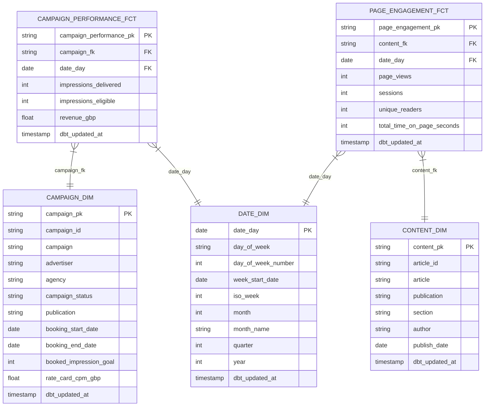

# Data Model Specification: Campaign Performance and Audience Engagement (Phase 1)

**Client**: Claybrook Media Group
**Project ID**: 01-campaign-dashboards
**Release type**: dashboard_first (seeded)
**Generated**: 2026-10-05
**Version**: 1.0
**Derived from**: `design/data_model_requirements.md`, `design/visualization_catalog.md`, `design/dashboard_spec.md`, `design/conceptual_model.md`
**Rulings applied**: R-1 (made-up names), R-6 (four engagement measures), R-8 (page is the grain of page engagement, no separate Page entity), R-10 (CPM and fill-rate formulas; Revenue Delivered and Active Campaigns kept)

This specification defines the dbt model structure for the two Phase 1 dashboards. Every model name, column, key, and test is fixed here so the dbt build and the LookML semantic layer have a single contract to follow.

Phase 1 runs on four seed files. The source tables in `source_tables_ddl.sql` are those four seeds. Phase 2 will map them to live Google Ad Manager (campaign delivery) and Google Analytics 4 (audience engagement) sources; that mapping is out of scope here.

The two subject areas are independent in Phase 1. There is no join key between a campaign and the articles or pages where its impressions were served (conceptual model section 3). The two explores stay separate.

## Model inventory

| Layer | Model | Materialisation | Grain |
|-------|-------|-----------------|-------|
| Staging | stg_campaign_performance | view | one row per campaign per day |
| Staging | stg_page_engagement | view | one row per article page per day |
| Warehouse (dim) | campaign_dim | table | one row per campaign |
| Warehouse (dim) | content_dim | table | one row per article |
| Warehouse (dim) | date_dim | table | one row per calendar day |
| Warehouse (fact) | campaign_performance_fct | table | one row per campaign per day |
| Warehouse (fact) | page_engagement_fct | table | one row per article page per day |

Model names follow the Statement of Work and the LookML explores (`campaign_performance`, `page_engagement`), which reference these exact names. They take precedence over the generic Wire `stg_<source>__<entity>` / `wh_<group>__<entity>_fact` naming here.

## Canonical vertical check (Step 1.5)

The data model registry at `~/.wire/data-model-registry/` was read. There is no media, publishing, or advertising vertical, so no confident vertical match exists for Claybrook. No adjacent vertical is a close structural fit: the closest cross-vertical patterns model raw event streams, not the pre-aggregated daily seed grain Phase 1 uses.

The audience engagement side will be sourced from GA4 in Phase 2. Two cross-vertical patterns are structurally relevant to that later work, `event_tracking_and_sessionization` and `ga4_ecommerce` (which depends on it). Neither fits Phase 1: the Phase 1 `page_engagement` seed holds one pre-aggregated row per article page per day, a coarser grain than the event-level and session-level structures those patterns model. They are not applied here. See the state file for the proposal recorded for director ruling. No registry entity was adopted, so no `generation_constraints` or `reference_implementation` pointers are carried forward.

## 1. Source Definitions

Phase 1 sources are the four seed files (see `source_tables_ddl.sql` for DDL). As seeds, they carry no freshness check. Phase 2 replaces them with live sources, at which point freshness thresholds apply (daily batch: warn after 25 hours, error after 49 hours).

| Seed | Holds | Phase 2 source |
|------|-------|----------------|
| campaign.csv | Campaign master | Google Ad Manager (orders / line items) |
| campaign_performance.csv | Daily campaign delivery | Google Ad Manager (delivery report) |
| article.csv | Article master | Content management system / GA4 content |
| page_engagement.csv | Daily page engagement | Google Analytics 4 |

Referential integrity (FR-6, NFR-5): `campaign_performance.csv` references `campaign.csv` on `campaign_id`; `page_engagement.csv` references `article.csv` on `article_id`. All names made up (R-1).

No columns are excluded for governance reasons. The seed holds no personal data: readers are counted, not identified (see the `unique_readers` note in section 4).

## 2. Staging Models

### stg_campaign_performance
**Source**: `campaign_performance.csv` (seed)
**Grain**: One row per campaign per day
**Materialisation**: view
**Tags**: `['staging', 'campaign']`
**Surrogate key**: `generate_surrogate_key(['campaign_id', 'activity_date'])` → `campaign_performance_pk`

| Source column | Staged column | Type | Notes |
|---------------|---------------|------|-------|
| campaign_id | campaign_id | string | Business key, references campaign.csv |
| date | activity_date | date | Delivery date |
| impressions_delivered | impressions_delivered | int | Non-negative |
| impressions_eligible | impressions_eligible | int | Non-negative; >= delivered for a valid fill rate |
| revenue_gbp | revenue_gbp | numeric(12,2) | GBP |

**Derived columns**:
- `campaign_fk`: `generate_surrogate_key(['campaign_id'])` (joins to `campaign_dim.campaign_pk`)

**Filters**: none
**Tests**: counted at the warehouse layer (section 8). Staging is a typed, renamed view; tests sit on the consumed warehouse models.

### stg_page_engagement
**Source**: `page_engagement.csv` (seed)
**Grain**: One row per article page per day
**Materialisation**: view
**Tags**: `['staging', 'content']`
**Surrogate key**: `generate_surrogate_key(['article_id', 'activity_date'])` → `page_engagement_pk`

| Source column | Staged column | Type | Notes |
|---------------|---------------|------|-------|
| article_id | article_id | string | Business key, references article.csv |
| date | activity_date | date | Engagement date |
| page_views | page_views | int | Non-negative |
| sessions | sessions | int | Non-negative |
| unique_readers | unique_readers | int | Daily per-page count; see section 4 note |
| total_time_on_page_seconds | total_time_on_page_seconds | int | Total, not a pre-computed average; see section 4 note |

**Derived columns**:
- `content_fk`: `generate_surrogate_key(['article_id'])` (joins to `content_dim.content_pk`)

**Filters**: none
**Tests**: counted at the warehouse layer (section 8).

## 3. Integration Models

Not applicable. The two subject areas are independent and need no cross-system joins or derived-flag logic in Phase 1.

## 4. Warehouse Models

### campaign_dim
**Grain**: One row per campaign
**Materialisation**: table
**Tags**: `['warehouse', 'dimension']`
**Source**: `campaign.csv` (seed)
**Surrogate key**: `generate_surrogate_key(['campaign_id'])` → `campaign_pk`

| Column | Type | Notes |
|--------|------|-------|
| campaign_pk | string | Surrogate key |
| campaign_id | string | Natural key |
| campaign | string | Campaign name (R-1) |
| advertiser | string | Advertiser name; attribute of campaign (R-1) |
| agency | string | Agency name; attribute of campaign (R-1). Filter only on Campaign Performance |
| campaign_status | string | Enum: Active, Paused, Completed, Pending |
| publication | string | Publication the campaign ran against (R-1). Independent attribute, see note below |
| booking_start_date | date | |
| booking_end_date | date | |
| booked_impression_goal | int | |
| rate_card_cpm_gbp | numeric(10,2) | GBP |
| dbt_updated_at | timestamp | `current_timestamp()` |

**publication note**: Campaign Performance uses `publication` in the Fill Rate by Publication chart and as a filter (R-10). The conceptual model describes publication only as an Article attribute. For Phase 1 there is no shared publication dimension and no join between the two subject areas, so `publication` is carried as an independent string attribute on `campaign_dim` and also on `content_dim`, drawing from the same domain of made-up names (R-1). Recorded as a proposal for director confirmation.

### content_dim
**Grain**: One row per article
**Materialisation**: table
**Tags**: `['warehouse', 'dimension']`
**Source**: `article.csv` (seed)
**Surrogate key**: `generate_surrogate_key(['article_id'])` → `content_pk`

| Column | Type | Notes |
|--------|------|-------|
| content_pk | string | Surrogate key |
| article_id | string | Natural key |
| article | string | Article title (R-1) |
| publication | string | Publication name (R-1) |
| section | string | Content section; attribute of article |
| author | string | |
| publish_date | date | |
| dbt_updated_at | timestamp | `current_timestamp()` |

Page is the grain of engagement (R-8). There is no separate Page entity; article-level reporting is the page-grain fact rolled up to the article.

### date_dim
**Grain**: One row per calendar day
**Materialisation**: table
**Tags**: `['warehouse', 'dimension']`
**Source**: generated date spine (no seed file). Built with `dbt_utils.date_spine` over the seed date range.

| Column | Type | Notes |
|--------|------|-------|
| date_day | date | Primary key, one row per day |
| day_of_week | string | |
| day_of_week_number | int | |
| week_start_date | date | Monday of the week; backs week-grain trend charts |
| iso_week | int | |
| month | int | |
| month_name | string | |
| quarter | int | |
| year | int | |
| dbt_updated_at | timestamp | `current_timestamp()` |

`date_dim` is keyed on the date value itself (`date_day`); facts carry `date_day` as the foreign key. `date` is rolled to week on the campaign trend charts (Impressions Delivered vs Eligible, Average CPM by Week) via `week_start_date`, and used at day grain on the audience trend chart (Page Views & Sessions by Day). Recorded as a proposal for director confirmation that `date_dim` is a generated spine, not a seed.

### campaign_performance_fct
**Grain**: One row per campaign per day
**Materialisation**: table
**Tags**: `['warehouse', 'fact']`
**Source**: `stg_campaign_performance`
**Surrogate key**: `campaign_performance_pk` (from `generate_surrogate_key(['campaign_id', 'activity_date'])`)

| Column | Type | Notes |
|--------|------|-------|
| campaign_performance_pk | string | Surrogate key |
| campaign_fk | string | → `campaign_dim.campaign_pk` |
| date_day | date | → `date_dim.date_day` |
| impressions_delivered | int | Measure component |
| impressions_eligible | int | Measure component |
| revenue_gbp | numeric(12,2) | Measure, GBP |
| dbt_updated_at | timestamp | `current_timestamp()` |

Foreign keys: `campaign_fk → campaign_dim.campaign_pk`, `date_day → date_dim.date_day`.

The fact stores measure components only. `fill_rate_pct`, `cpm_gbp` and `active_campaign_count` are calculated in the LookML semantic layer, not stored here (see section 9).

### page_engagement_fct
**Grain**: One row per article page per day (page is the grain, no separate Page entity, R-8)
**Materialisation**: table
**Tags**: `['warehouse', 'fact']`
**Source**: `stg_page_engagement`
**Surrogate key**: `page_engagement_pk` (from `generate_surrogate_key(['article_id', 'activity_date'])`)

| Column | Type | Notes |
|--------|------|-------|
| page_engagement_pk | string | Surrogate key |
| content_fk | string | → `content_dim.content_pk` |
| date_day | date | → `date_dim.date_day` |
| page_views | int | Measure; also the denominator for average time on page |
| sessions | int | Measure |
| unique_readers | int | Daily per-page count; see note below |
| total_time_on_page_seconds | int | Total time; numerator for average time on page |
| dbt_updated_at | timestamp | `current_timestamp()` |

Foreign keys: `content_fk → content_dim.content_pk`, `date_day → date_dim.date_day`.

**unique_readers note**: The fact stores a daily per-page `unique_readers` count. This count must not be summed across days or pages to give true unique readers: a reader who returns on two days, or reads two pages, is one unique reader but would be counted twice. A true distinct count needs a reader-level grain the Phase 1 seed does not hold. The semantic layer will present the measure as a sum labelled as a daily-unique total (an upper bound), not as true distinct readers. Recorded as a proposal for director confirmation.

**avg_time_on_page note**: The fact stores `total_time_on_page_seconds` (numerator) and `page_views` (denominator). The average is computed in the semantic layer as `sum(total_time_on_page_seconds) / sum(page_views)`, a weighted ratio. A pre-computed per-row average is not stored, because averaging averages would be wrong under filters and roll-ups.

## 5. Seed Files

The four SOW seeds are the project seeds. Their column contracts are in `source_tables_ddl.sql`. Seed data content is generated by the seed_data stage (R-12), not here. No configurable-logic seeds (threshold or mapping tables) are needed.

| Seed | Purpose | Key columns |
|------|---------|-------------|
| campaign.csv | Campaign master | campaign_id (PK), campaign, advertiser, agency, campaign_status, publication, booking dates, booked_impression_goal, rate_card_cpm_gbp |
| campaign_performance.csv | Daily campaign delivery | campaign_id (FK), date, impressions_delivered, impressions_eligible, revenue_gbp |
| article.csv | Article master | article_id (PK), article, publication, section, author, publish_date |
| page_engagement.csv | Daily page engagement | article_id (FK), date, page_views, sessions, unique_readers, total_time_on_page_seconds |

`date_dim` has no seed; it is a generated spine over the seed date range.

## 6. Cross-System Join Keys

None in Phase 1. The two subject areas do not join (conceptual model section 3). Within each subject area the join keys are:

| Left model | Column | Right model | Column | Notes |
|-----------|--------|------------|--------|-------|
| campaign_performance_fct | campaign_fk | campaign_dim | campaign_pk | Surrogate of campaign_id |
| campaign_performance_fct | date_day | date_dim | date_day | Date value |
| page_engagement_fct | content_fk | content_dim | content_pk | Surrogate of article_id |
| page_engagement_fct | date_day | date_dim | date_day | Date value |

## 7. Physical Data Model

The two facts share `date_dim` but have no path to each other, matching the Phase 1 scope boundary.

## 8. dbt Test Coverage Plan

18 tests total, meeting the SOW acceptance count. All 18 sit on the five warehouse models, which the explores read.

| # | Model | Column | Test |
|---|-------|--------|------|
| 1 | campaign_dim | campaign_pk | unique |
| 2 | campaign_dim | campaign_pk | not_null |
| 3 | campaign_dim | campaign_status | accepted_values (Active, Paused, Completed, Pending) |
| 4 | content_dim | content_pk | unique |
| 5 | content_dim | content_pk | not_null |
| 6 | date_dim | date_day | unique |
| 7 | date_dim | date_day | not_null |
| 8 | campaign_performance_fct | campaign_performance_pk | unique |
| 9 | campaign_performance_fct | campaign_performance_pk | not_null |
| 10 | campaign_performance_fct | campaign_fk | relationships → campaign_dim.campaign_pk |
| 11 | campaign_performance_fct | date_day | relationships → date_dim.date_day |
| 12 | campaign_performance_fct | impressions_delivered | not_null |
| 13 | campaign_performance_fct | impressions_eligible | not_null |
| 14 | page_engagement_fct | page_engagement_pk | unique |
| 15 | page_engagement_fct | page_engagement_pk | not_null |
| 16 | page_engagement_fct | content_fk | relationships → content_dim.content_pk |
| 17 | page_engagement_fct | date_day | relationships → date_dim.date_day |
| 18 | page_engagement_fct | page_views | not_null |

**Total: 18 tests.** The two `relationships` tests on the fact foreign keys (10, 16) enforce referential integrity (FR-6, NFR-5): every delivery row resolves to a campaign, every engagement row resolves to an article.

## 9. Calculated measures (semantic layer, FR-9)

These are defined in LookML on the facts above, not stored as columns. Each is aggregate-aware: computed from summed components, not from averaged per-row ratios.

| Measure | Formula (R-10) | Model | Guard |
|---------|----------------|-------|-------|
| fill_rate_pct | sum(impressions_delivered) / sum(impressions_eligible) x 100 | campaign_performance_fct | null / zero when eligible = 0 |
| cpm_gbp | sum(revenue_gbp) / sum(impressions_delivered) x 1000 | campaign_performance_fct | null / zero when delivered = 0 |
| active_campaign_count | count(distinct campaign) where campaign_status = 'Active' | campaign_dim | filtered to Active |
| avg_time_on_page_seconds | sum(total_time_on_page_seconds) / sum(page_views) | page_engagement_fct | null / zero when page_views = 0; displayed as minutes:seconds |
| unique_readers | sum(unique_readers) | page_engagement_fct | daily-unique upper bound, not true distinct (see section 4) |

## 10. Items flagged for the director

1. **publication on the campaign side.** Carried as an independent attribute on `campaign_dim` (and on `content_dim`), same made-up-name domain, no shared publication dimension in Phase 1.
2. **date_dim is a generated spine**, not a seed; built over the seed date range.
3. **unique_readers** stored as a daily per-page count; presented in the semantic layer as a sum labelled as a daily-unique total (upper bound), not true distinct readers.
4. **avg_time_on_page** stored as components (`total_time_on_page_seconds` and `page_views`); averaged as a weighted ratio in the semantic layer.
